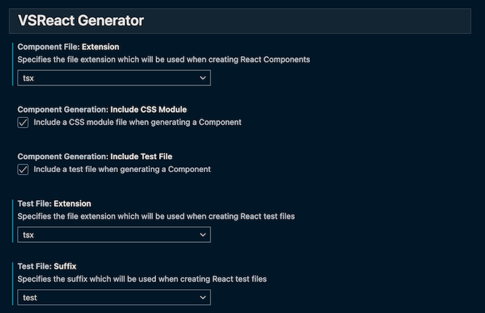

# VSReact Generator

VSReact Generator is a tool which gives you some handy shortcuts that can help streamline your workflow when building React applications.

## Features

Creating a new Component or a test file for an existing Component is very common when building a React application.

VSReact streamlines this process by autogenerating files for you to speed up your development.

The first use case (shown below) is when you have to create a new React Component from scratch. Every time you build a new React Component you also often have to build a folder, a Component file, a test file and often a CSS midule file.

With VSReact you can do all of this quickly by using a handy context menu item

Another common use case when developing a React application is the need to generate a test file for an existing Component.

This can also be done easily from the context menu

Or from the Command Palette if you already have the Component file open

## Extension Settings

This extension contributes the following settings:

- `vscode-react-generator.componentFile.extension`

Specifies the file extension which will be used when creating React Components.

When creating a Component you can choose to create it using typescript with a .tsx file extension or using JSX with a .jsx file extension.

- `vscode-react-generator.componentGeneration.includeCssModule`

Include a CSS module file when generating a Component.

When creating a Component this flag can be set to determine whether or not to also create a CSS module file along side your Component file. CSS module files are currently named `ComponentName.module.css` and are created with an empty template.

- `vscode-react-generator.componentGeneration.includeTestFile`

Include a test file when generating a Component.

When creating a Component this flag can be set to determine whether or not to also create an accompanying test file. Test files will be named using the following pattern `ComponentName.[spec|test].[ts|js|tsx|jsx]` depending on the following two additional flags.

Test files are currently created with a simple Jest / React Testing Library template.

- `vscode-react-generator.testFile.suffix`

Specifies the suffix which will be used when creating React test files

- `vscode-react-generator.testFile.extension`

Specifies the file extension which will be used when creating React test files

## Configuration Options

## Known Issues

N/A

## Release Notes

### 1.0.0

Initial release
